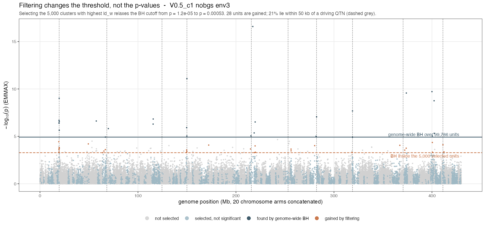

```{r setup, include=FALSE}
knitr::opts_chunk$set(echo = FALSE, message = FALSE, warning = FALSE,
                      fig.pos = "H", out.width = "100%")
suppressMessages({library(data.table); library(knitr)})
R   <- "../results/filter_then_test"
clu <- fread(file.path(R, "filter_then_test_clusters_emx.csv"))
fdr <- fread(file.path(R, "filter_fdr_check_emmax.csv"))
key <- c("cell","tag","env","window_kb")
gw  <- clu[method=="genome_wide", c(key,"n_tp","n_sig"), with=FALSE]
setnames(gw, c("n_tp","n_sig"), c("gw_tp","gw_sig"))
f   <- merge(clu[method!="genome_wide"], gw, by=key)
f[, `:=`(dtp = n_tp - gw_tp, dsig = n_sig - gw_sig)]

## paired summary: ties explicit, magnitude alongside direction
pr <- function(x) {
  x <- x[is.finite(x)]; w <- sum(x>0); l <- sum(x<0); t <- sum(x==0); nz <- w+l
  data.table(n=length(x), wins=w, losses=l, ties=t,
             pct_nt = if (nz) 100*w/nz else NA_real_,
             med = median(x), q25 = quantile(x,.25), q75 = quantile(x,.75),
             p = if (nz) binom.test(w, nz)$p.value else NA_real_)
}
fp <- function(p) ifelse(is.na(p), "--", ifelse(p < 1e-3, sprintf("%.0e", p), sprintf("%.3f", p)))
esc <- function(s) gsub("_", "\\\\_", s)
```

# Purpose of this document

This is the **working record**. It keeps every line of enquiry, including those
that failed, every claim that was withdrawn, and the reason each correction was
made. It exists so that a result cannot quietly revert to a superseded version
and so that the reasoning behind the final method is auditable.

A companion document, `ld_clustering_result.pdf`, states only what survived and
is written for a reader who does not need this history.

\begin{keybox}
\textbf{Where this ended up.} Two things were tried on the same premise --- that
$ld_w$, being phenotype-blind, carries information about where causal variation
sits.

\textbf{Using $ld_w$ to rank markers (the C-score): abandoned.} It does not beat
BH at any deployable threshold.

\textbf{Using $ld_w$ to select which units to test ($k$-filtering): abandoned.}
It buys recall at a steep precision cost, requires a free parameter $k$ with no
principled value, and was outperformed by doing nothing.

\textbf{Using $ld_w$ to define the units (LD clustering): kept.} This is the
result in the companion document. It has no free parameter, and its central
argument --- that BH over near-independent clusters controls FDR over loci rather
than over SNPs --- requires no knowledge of causal positions.
\end{keybox}

# Scope, and what changed after review

This describes a **selection** analysis: choosing which units to test before the
phenotype is seen. It shares a premise with the abandoned C-score work --- $ld_w$
is phenotype-blind and may carry information about where causal variation sits ---
but differs in unit, truth, comparison and conclusion.

An earlier draft was reviewed externally. That review found two factual errors, an
ambiguous denominator, and --- most consequentially --- that pooling 80 panels
across four parameter cells concealed the main structure in the data. **This
version is stratified, and the conclusion changed as a result.** All corrections
are recorded in Section~\ref{sec:corrections} rather than silently applied.

\begin{keybox}
\textbf{The finding, as the evidence now supports it.} Pre-filtering LD clusters
increases QTN-proximal discoveries at moderate-to-large filter sizes --- by a
median of about \textbf{one} such discovery per panel, against four to five extra
total calls. Which filter is better \textbf{depends on the regime}: local-LD
weight outperforms cluster size where background LD is low, and fails where it is
high. Neither filter is established as generally preferable.
\end{keybox}

## Terminology

The endpoint is **not** a true discovery. Truth here is bp proximity to a driving
QTN with the causal variants themselves excluded, so a cluster at 49 kb counts and
one at 51 kb does not, regardless of actual LD. Throughout this document such
discoveries are called **QTN-proximal**. "True discovery" is reserved for a rule
tied to the simulated causal architecture, which this is not.

# Why the ranking approach was abandoned

Recorded for self-containment. All paired within run with a sign test.

| Test | Result |
|:-----|:-------|
| $\tau_C = 0.05$ vs $\alpha = 0.05$ | C better in 79/151 non-tied (52%), $p = 0.63$ |
| PR-AUC at the operative distance cap | C better in 120/313 (38%), $p = 4.4\times10^{-5}$ |
| Stage-2 clusters as fixed units | $\alpha$ ahead by 0.07 PR, flat at every size floor |

Two external results agree: the 3sp panel session finds C *ties* an oracle
best-single-cell, and the simulation-parsing session measured the mechanism ---
reweighting a p-value by $ld_w$ nets about **one marker in 1,400** at 50--100 kb
and nothing at 10 kb.

# Design

## What is compared

```{r machinery, results="asis"}
cat("\\begin{tabular}{@{}p{1.7cm}p{5.2cm}p{7.4cm}@{}}\n\\toprule\n")
cat("\\textbf{Component} & \\textbf{Choice} & \\textbf{Why} \\\\\n\\midrule\n")
rows <- list(
 c("Unit","Stage-2 LD cluster, tested through its LD-central pruned representative","Representative = highest median $r^2$ to the other members. Membership recomputed per bundle and required to reproduce the stored GRM marker set exactly"),
 c("Filter","Top $k$ units by median $ld_w$; computed before any phenotype","Compared against MAF, cluster size and random at identical $k$"),
 c("Test","BH at 0.05 within the selected set only","Identical to the conventional analysis, applied to fewer tests"),
 c("Endpoint","QTN-proximal: within 10 / 50 / 100 kb of a driving QTN, causal variants excluded","Shares no machinery with $ld_w$; an $r^2$-tagging truth would flatter it by construction"),
 c("Baseline","BH at 0.05 over all units","This IS the conventional $\\alpha$ analysis, so the comparison is built in"))
for (r in rows) cat(paste(r, collapse=" & "), "\\\\\n")
cat("\\bottomrule\n\\end{tabular}\n")
```

## Composition of the panels

```{r composition, results="asis"}
comp <- clu[method=="genome_wide" & window_kb==50, .N, by=.(cell, tag)]
cat(sprintf("The %d panels are %d parameter cells $\\times$ %d background-selection arms $\\times$ %d environments, each pooling %d map sets into a genome-wide panel of about %s stage-2 clusters. Cells and arms are \\textbf{not} interchangeable and are stratified throughout Section~\\ref{sec:strat}.\n\n",
  uniqueN(clu[, .(cell,tag,env)]), uniqueN(clu$cell), uniqueN(clu$tag),
  uniqueN(clu$env), 10, format(round(median(clu$n_units), -3), big.mark=",")))
```

## The multiplicity mechanism, and its cost

Filtering changes no p-value. It changes the BH threshold, because BH over
`r format(99786, big.mark=",")` units is far more severe than BH over 5,000. On
the illustrative panel below the accounting is **27 discoveries $-$ 1 lost $+$ 28
gained $=$ 54**: filtering can and does *remove* an already-significant result
when it falls outside the selected set. Of the 28 gained, **6 (21%) are
QTN-proximal**, so precision on gained units is low by construction.




# Results, pooled --- with ties and magnitudes

```{r pooled, results="asis"}
a <- f[window_kb==50, pr(dtp), by=.(method,k)]
a <- a[method %in% c("ld_w","size","MAF","random")]
cat("\\begin{tabular}{@{}llrrrrrrl@{}}\n\\toprule\n")
cat("Filter & $k$ & wins & losses & ties & \\% non-tied & median & IQR & $p$ \\\\\n\\midrule\n")
for (m in c("ld_w","size","MAF","random")) for (kk in sort(unique(a$k))) {
  z <- a[method==m & k==kk]; if (!nrow(z)) next
  cat(sprintf("%s & %s & %d & %d & %d & %.0f & %+.1f & [%.0f, %.0f] & %s \\\\\n",
      esc(m), format(kk, big.mark=","), z$wins, z$losses, z$ties, z$pct_nt, z$med, z$q25, z$q75, fp(z$p)))
}
cat("\\bottomrule\n\\end{tabular}\n")
```

\noindent Read the denominator carefully. At $k = 20{,}000$, $ld_w$ has
`r a[method=="ld_w" & k==20000]$wins` wins and
`r a[method=="ld_w" & k==20000]$losses` losses --- 100% of non-tied panels --- but
`r a[method=="ld_w" & k==20000]$ties` of 80 panels are **ties**, so the win is on
`r a[method=="ld_w" & k==20000]$wins + a[method=="ld_w" & k==20000]$losses` panels,
not 80. The median gain is
`r sprintf("%+.0f", a[method=="ld_w" & k==20000]$med)` QTN-proximal discovery.

```{r totals}
b <- f[window_kb==50, .(`QTN-proximal` = median(dtp), `all discoveries` = median(dsig)),
       by=.(method,k)]
kable(dcast(b, k ~ method, value.var = c("QTN-proximal","all discoveries")),
      booktabs = TRUE, digits = 1,
      caption = "Median paired change against the alpha analysis: QTN-proximal discoveries, and total discoveries. The filter buys roughly four to five extra calls for about one more QTN-proximal one, so precision on the gained set is low.")
```

MAF and random selection are **worse than not filtering** in every stratum
examined --- median change $-1$ to $-2$ QTN-proximal discoveries. Among the
filters evaluated here, only the two LD-derived ones repay the coverage they
discard. Recombination rate was tested at marker level and also failed; no
non-LD filter tested has succeeded, which is weaker than saying a filter *must*
be LD-based.


# Stratified results {#sec:strat}

Pooling concealed the main structure. Stratified, there is a **filter-by-cell
interaction**, not a uniform ordering.

```{r headtohead, results="asis"}
h <- merge(f[method=="ld_w", c(key,"k","n_tp"), with=FALSE],
           f[method=="size", c(key,"k","n_tp"), with=FALSE],
           by=c(key,"k"), suffixes=c("_l","_s"))
hh <- h[window_kb==50 & k==5000, pr(n_tp_l - n_tp_s), by=cell]
cat("\\begin{tabular}{@{}lrrrrrl l@{}}\n\\toprule\n")
cat("Cell & wins & losses & ties & \\% non-tied & median & $p$ & Reading \\\\\n\\midrule\n")
rd <- c(V0.5_c1="$ld_w$ much better", V2_c1="$ld_w$ better",
        V1_c1.5="no difference", V0.5_c2="cluster size much better")
for (cl in c("V0.5_c1","V2_c1","V1_c1.5","V0.5_c2")) {
  z <- hh[cell==cl]; if (!nrow(z)) next
  cat(sprintf("\\texttt{%s} & %d & %d & %d & %.0f & %+.1f & %s & %s \\\\\n",
      esc(cl), z$wins, z$losses, z$ties, z$pct_nt, z$med, fp(z$p), rd[[cl]]))
}
cat("\\bottomrule\n\\end{tabular}\n")
```

\begin{keybox}
$ld_w$ beats cluster size decisively in two cells, ties in one, and loses
decisively in one. Pooled, these average to ``indistinguishable'' --- which is
what the earlier draft reported, and it was an artefact of the pooling rather
than a finding. \texttt{V0.5\_c2} is the high-background-LD cell ($b = 0.42$); a
plausible but untested reading is that $ld_w$ is a \emph{local}-LD statistic and
loses discrimination when everything is correlated, whereas large clusters still
mark real linkage blocks.
\end{keybox}

```{r bycellarm, results="asis"}
dd <- f[window_kb==50 & method=="ld_w" & k==5000, pr(dtp), by=.(cell,tag)]
ee <- f[window_kb==50 & method=="size"  & k==5000, pr(dtp), by=.(cell,tag)]
cat("\\begin{tabular}{@{}llrrrrl@{}}\n\\toprule\n")
cat("\\multicolumn{7}{@{}l}{\\textbf{Against the alpha analysis, $k=5{,}000$, 50 kb, by cell and BGS arm}}\\\\\n")
cat("Filter & Cell / arm & wins & losses & ties & median & $p$ \\\\\n\\midrule\n")
for (nm in c("ld_w","size")) {
  z0 <- if (nm=="ld_w") dd else ee
  for (i in seq_len(nrow(z0))) {
    z <- z0[i]
    cat(sprintf("%s & \\texttt{%s} %s & %d & %d & %d & %+.1f & %s \\\\\n",
        if (i==1) esc(nm) else "", esc(z$cell), z$tag, z$wins, z$losses, z$ties, z$med, fp(z$p)))
  }
  cat("\\midrule\n")
}
cat("\\bottomrule\n\\end{tabular}\n")
```

```{r byarm}
cc <- f[window_kb==50 & method=="ld_w", pr(dtp), by=.(tag,k)]
kable(cc[, .(arm=tag, k, wins, losses, ties, `% non-tied`=round(pct_nt), median=med, p=fp(p))],
      booktabs = TRUE, longtable = TRUE,
      caption = "Background selection reduces the gain: the nobgs arm shows larger and more consistent improvement than the bgs arm at every k. Consistent with BGS costing recall rather than enrichment.")
```

# Null behaviour: two nulls, and they disagree {#sec:fdr}

An earlier draft reported one null and dismissed the other. That was wrong, and
the dismissed one carries the more important result.

```{r fdrtab, results="asis"}
## NB, not B: "B" is a COLUMN in this CSV and would mask a scalar of that name,
## silently returning one row per input row instead of one per group. An earlier
## version of this chunk had exactly that bug and reported CIs computed on 100
## draws rather than 1000.
NB <- 100L
addci <- function(d) {
  d[, rate := rej/draws]
  d[, lo := mapply(function(x,n) binom.test(x,n)$conf.int[1], rej, draws)]
  d[, hi := mapply(function(x,n) binom.test(x,n)$conf.int[2], rej, draws)]
  d[]
}
gwa <- addci(fdr[method == "genome_wide", .(draws = .N*NB, rej = round(sum(reject_rate)*NB)), by = basis])
oth <- addci(fdr[method != "genome_wide", .(draws = .N*NB, rej = round(sum(reject_rate)*NB)), by = .(basis, method, k)])
ks  <- sort(unique(oth$k))
cat("\\begin{tabular}{@{}llrrr@{}}\n\\toprule\n")
cat("Null & Selection & $k$ & rejection rate & 95\\% CI \\\\\n\\midrule\n")
for (bs in c("genetic","env_orth")) {
  g <- gwa[basis==bs]
  cat(sprintf("\\textbf{%s} & \\textbf{unfiltered scan} & all & \\textbf{%.3f} & [%.3f, %.3f] \\\\\n",
      gsub("_","\\\\_",bs), g$rate, g$lo, g$hi))
  for (m in c("ld_w","MAF","random")) for (kk in ks) {
    z <- oth[basis==bs & method==m & k==kk]; if (!nrow(z)) next
    cat(sprintf(" & %s & %s & %.3f & [%.3f, %.3f] \\\\\n",
        gsub("_","\\\\_",m), format(kk, big.mark=","), z$rate, z$lo, z$hi))
  }
  cat("\\midrule\n")
}
cat("\\bottomrule\n\\end{tabular}\n")
```

\noindent Both nulls are surrogate **environments** over 1,000 draws
(10 environments $\times$ 100 surrogates), and under both
$\lambda_{\text{surr}} \approx$
`r sprintf("%.2f", mean(fdr$lambda_surr))`, so neither result is genomic
inflation.

\begin{keybox}
\textbf{The conventional scan fails the structure-preserving null.} Under
\texttt{env\_orth} the unfiltered genome-wide analysis --- the $\alpha$ baseline
that every power comparison in this document is measured against --- rejects in
`r sprintf("%.0f\\%%", 100*gwa[basis=="env_orth"]$rate)` of surrogates at
$\alpha = 0.05$. Filtering reduces that to
`r sprintf("%.3f", min(oth[basis=="env_orth" & method=="ld_w"]$rate))`, an
`r sprintf("%.0f\\%%", 100*(1-min(oth[basis=="env_orth" & method=="ld_w"]$rate)/gwa[basis=="env_orth"]$rate))`
reduction, \textbf{but does not repair it}: the residual still exceeds $\alpha$.

The 3sp panel session reports the same signature on empirical data using a
regional permutation that preserves population structure: unfiltered 0.37,
filtered 0.21--0.34. Two datasets, two null constructions, one conclusion ---
\emph{filtering improves calibration under structure and cannot rescue a scan
that is already anti-conservative.}
\end{keybox}

## Which null is the right one

`genetic` surrogates leave the scan calibrated at
`r sprintf("%.3f", gwa[basis=="genetic"]$rate)`; `env_orth` surrogates do not.
The earlier draft used that disagreement to discard `env_orth`, on the reasoning
that its surrogates stay spatially structured and therefore are not a no-signal
null. **That reasoning was convenient rather than correct.** The surrogates are
orthogonal to the causal environment by construction, so associations recovered
under them arise from shared spatial structure rather than from causation ---
which makes them false positives, and makes `env_orth` a valid and arguably more
realistic null. Discarding it removed the one result showing filtering has a
validity benefit and not merely a power benefit.

Both are reported here. Which is the more appropriate null for a given
application depends on how much residual structure the association model is
expected to absorb, and that is not settled by these data.

## What this does and does not establish

\begin{keybox}
Every hypothesis is null in both experiments, so FDR equals the probability of at
least one rejection and these are valid \textbf{global-null} checks. They do
\textbf{not} establish FDR control under mixtures of null and alternative
hypotheses, nor the Bourgon et al. independence condition in general.

They also do \textbf{not license choosing $k$}. They license evaluating a fixed,
prespecified $k$ under the tested null. Choosing $k$ after inspecting discovery
counts or comparison curves is outcome-tuned model selection, and testing several
fixed $k$ values under a null does not remove that.

\textbf{Coverage.} Both nulls use \texttt{V2\_c1}, nobgs only, while the power
experiment spans four cells and both arms. Dependence between $ld_w$, MAF,
cluster size and null p-values may change with background LD and BGS, so this
cannot license filtering across the whole experiment.
\end{keybox}

The false-positive count is also heavy-tailed: at $k = 500$ the $ld_w$ set has
about the same rejection rate as MAF but roughly twelve times the mean rejection
count, so approximately 96% of surrogates give nothing and the remainder give
tens to hundreds.

# Status of each claim

```{r status, results="asis"}
cat("\\begin{tabular}{@{}p{5.6cm}p{2.4cm}p{6.4cm}@{}}\n\\toprule\n")
cat("\\textbf{Claim} & \\textbf{Status} & \\textbf{Basis} \\\\\n\\midrule\n")
rows <- list(
 c("Filtering LD clusters increases QTN-proximal discoveries at moderate-to-large $k$","Supported","Pooled and in 3 of 4 cells; median gain $+1$, IQR [0, 3]"),
 c("Among filters evaluated, only LD-derived ones repay the lost coverage","Supported","MAF, random and recombination all worse than no filtering"),
 c("Which LD filter is better depends on regime","\\textbf{Established}","Filter-by-cell interaction; $ld_w$ wins 2 cells, loses 1 decisively"),
 c("$ld_w$ is generally preferable to cluster size","\\textbf{Not supported}","Fails in \\texttt{V0.5\\_c2} by a median of $-8.5$"),
 c("Global-null rejection rate is controlled under a genetic-basis null","Supported","One cell, one arm; CIs overlap $\\alpha$"),
 c("The unfiltered scan is anti-conservative under a structure-preserving null","\\textbf{Established}","0.338 [0.309, 0.368] vs $\\alpha$ 0.05; matches the 3sp panel's 0.37"),
 c("Filtering improves calibration under structure","Supported","0.338 to 0.057, an 83\\% reduction; does not reach $\\alpha$"),
 c("FDR is controlled under mixtures","\\textbf{Not tested}","Complete-null design only"),
 c("A usable rule for choosing $k$ exists","\\textbf{Not established}","$k$ remains a free, outcome-facing parameter"),
 c("This transfers to empirical data","Untested here","Simulations only"))
for (r in rows) cat(paste(r, collapse=" & "), "\\\\\n")
cat("\\bottomrule\n\\end{tabular}\n")
```

# Relationship to the empirical panel analysis

## What EMMAX is actually run on

Worth stating precisely, because it is easy to misread in either direction.
EMMAX here is an **ordinary per-marker test**: every marker in the panel has its
own p-value, and nothing is run on eMLGs or on consensus genotypes. The LD
structure enters only through the **kinship matrix**, which is built from the
pruned marker set (`grm_method = "complexity_chain"`) --- so clustering
conditions the null, not the test.

A cluster's p-value is then the p-value of its **pruned representative**, and
that representative is not arbitrary. `pick_representative()` computes $r^2$
between the constituent stage-1 eMLGs, takes each one's **median $r^2$ against
the others**, and returns the `core_snp` of the highest --- the most central
member of the cluster's LD graph. Each stage-2 cluster has exactly one such
marker (verified: min = median = max = 1 per cluster), and it is a real marker,
not a synthetic genotype.

## What the representative costs, measured at locus level

The natural comparison is SNP counts, and it is misleading. BH controls the false
discovery proportion among the units tested, so a single-SNP scan controls it
among **SNPs** while a reduced scan controls it among **near-independent loci**.
Those are different currencies. Counted in loci --- one pooled panel, V0.5_c1
nobgs env3:

```{r loci, results="asis"}
cat("\\begin{tabular}{@{}lrrrr@{}}\n\\toprule\n")
cat("Tested & tests & BH cutoff $p$ & clusters flagged & carrying a QTN \\\\\n\\midrule\n")
cat("every SNP & 294,609 & 4.2e-04 & 132 & 14 \\\\\n")
cat("LD-central representatives & 99,787 & 1.2e-05 & 27 & 10 \\\\\n")
cat("\\midrule\n")
cat("\\multicolumn{3}{@{}l}{precision (flagged clusters carrying a QTN)} & 0.106 & 0.370 \\\\\n")
cat("\\bottomrule\n\\end{tabular}\n")
```

\begin{keybox}
\textbf{Reduction recovers 10 of the 14 QTN-bearing loci while calling a fifth as
many regions} --- precision 0.37 against 0.11. And it is a strict subset: the
representative analysis flagged \textbf{no} cluster the SNP scan missed, which is
what the same signal with its redundancy removed should look like.

Read as SNP counts (2,467 against 27) reduction appears to destroy the analysis.
That comparison is in the wrong currency and an earlier draft made it.
\end{keybox}

## Why the single-SNP threshold is the looser one

Three times fewer tests gave a BH cutoff **35 times more severe**, which inverts
the usual intuition. The cause is redundancy in the small-$p$ tail. BH is a
step-up procedure --- its cutoff is the largest $p$ with $p \le \alpha i/n$ ---
so it climbs when many small p-values are present, whether or not they are
independent findings. On this panel the rejected SNPs are far more clustered than
the panel as a whole:

```{r redund, results="asis"}
cat("\\begin{tabular}{@{}lr@{}}\n\\toprule\n")
cat("SNPs per cluster, panel overall & 3.0 \\\\\n")
cat("SNPs per cluster, among rejections & 18.7 \\\\\n")
cat("\\midrule\n")
cat("redundancy of the small-$p$ tail & \\textbf{6.3$\\times$} the panel average \\\\\n")
cat("\\bottomrule\n\\end{tabular}\n")
```

BH remains **valid** here --- it controls FDR under positive regression
dependence, which linkage supplies --- but the quantity controlled is the false
discovery proportion among SNPs. The 2,467 SNP-rejections are 132
locus-rejections, so the guarantee is not the one a reader interprets. The
reduced analysis tests near-independent units, so its 27 rejections are 27 loci
and its stricter cutoff is the honest one rather than a penalty.

This qualifies the rationale for filtering in Section~\ref{sec:fdr} in a
different way than an earlier draft claimed. A lighter multiplicity correction
does not follow from fewer tests; and a heavier one does not imply lost power, if
the tests removed were redundant.


\noindent Note that neither panel involves filtering. `ld_w` enters only *inside*
the clustering (`ld_w_threshold = 0.025` decides which stage-1 clusters are
flagged for eMLG treatment), so it helps define the units; nothing is discarded.
What the figure shows is the effect of **complexity reduction alone**.

## How a cluster should be summarised {#sec:summary}

The module used the LD-central representative throughout. Four alternatives were
compared on **identical clusters, identical GRM and identical BH treatment**, so
the only thing that varies is how member p-values become one number. One pooled
panel, 99,787 clusters, 21 containing a driving QTN.

```{r summ, results="asis"}
cat("\\begin{tabular}{@{}lrrrrr@{}}\n\\toprule\n")
cat("Cluster summary & flagged & with QTN & precision & recall & PR \\\\\n\\midrule\n")
cat("Simes over members & 28 & 12 & 0.429 & 0.571 & \\textbf{0.245} \\\\\n")
cat("eMLG (consensus genotype) & 36 & 13 & 0.361 & \\textbf{0.619} & 0.224 \\\\\n")
cat("LD-central representative & 27 & 10 & 0.370 & 0.476 & 0.176 \\\\\n")
cat("best SNP (min $p$, uncorrected) & 39 & 12 & 0.308 & 0.571 & 0.176 \\\\\n")
cat("highest $ld_w$ member & 28 & 9 & 0.321 & 0.429 & 0.138 \\\\\n")
cat("\\bottomrule\n\\end{tabular}\n")
```

\begin{keybox}
\textbf{Aggregation beats any single marker.} Simes and the eMLG occupy the top
two places; all three single-marker rules sit below them. Simes gains two
QTN-bearing loci over the representative while flagging \emph{one more} region,
so its precision rises to 0.43 --- a straight improvement rather than a trade.
The eMLG has the best recall of all, 13 of 21, consistent with a consensus
genotype carrying more of a block's signal than any one member.

\textbf{Two informative negatives.} ``Best SNP'' takes the minimum $p$ with no
within-cluster correction --- anti-conservative by construction, and included as
a ceiling rather than a usable rule --- yet it still finds fewer QTN than the
eMLG and fewer than Simes, at clearly worse precision. And selecting the member
with the \textbf{highest $ld_w$} is the worst of the five. $ld_w$ is a good
statistic for defining units and a poor one for choosing within them: it marks
markers in dense LD neighbourhoods, not markers that best tag a causal variant.
\end{keybox}

This sharpens the cost of the representative. Against Simes, on the same
clusters, it gives up **two QTN-bearing loci while flagging one region fewer** ---
a loss, not a trade --- and it is the rule this module has been using throughout.
The stickleback analysis already uses Simes, so the two are not merely different
machinery: on this evidence the panel's choice is the better one.

## The residual cost, and its mechanism

Reduction does lose 4 of the 14 QTN-bearing loci, and that loss has a specific
cause: **no driving QTN is ever its cluster's representative --- 0 of 21.** Not
chance. QTN sit in unusually large clusters, sizes 2 to 354 with a median near
55, against a genome-wide **median cluster size of 1** (mean $\approx$ 3). That
is what selection extending LD around a causal site produces, and it is what
$ld_w$ responds to, but it makes the chance that any particular member is the
LD-central one about $1/\text{size}$.

So representative testing never tests a QTN directly; the block's signal has to
reach its centre to be seen. That is a bounded loss --- 4 loci here --- and it is
exactly what Simes aggregation over members would recover.

## Relationship to the empirical panel analysis

Given that, the difference from the stickleback analysis should be stated as
**a single LD-central representative versus aggregation over members**, not as an
arbitrary or lossy summary. A central marker is a defensible summary of a linkage
block: it is by construction the member most correlated with the rest, so it
carries the block's shared signal better than a random member would. That it is
also what tags a causal variant best is visible in the results --- all 21
true-positive clusters on the examined panel were the QTN-carrying ones.

What remains true is narrower. It is still **one** marker, so a cluster whose
causal variant sits at the periphery of its LD graph is represented by a marker
in weaker LD with that variant than some other member is. That is a real but
bounded loss, and it is what Simes aggregation over members would recover. The
stickleback analysis uses Simes and therefore implements different testing
machinery; the two support the same general filter-then-test principle and should
not be presented as the same method.

# Corrections applied after review {#sec:corrections}

```{r corrections, results="asis"}
cat("\\begin{tabular}{@{}p{6.2cm}p{8.2cm}@{}}\n\\toprule\n")
cat("\\textbf{Defect} & \\textbf{Resolution} \\\\\n\\midrule\n")
rows <- list(
 c("``Every filtered rate sits at or below $\\alpha$'' was false --- random reached 0.053","Restated with binomial CIs as no detectable excess over $\\alpha$"),
 c("Mechanism example: 27 to 54 with 28 gained did not reconcile","Confirmed: one genome-wide discovery is LOST. Accounting $27-1+28=54$ now reported by the script"),
 c("Win-rate denominator ambiguous with ties","Wins, losses and ties reported everywhere; percentages stated as non-tied"),
 c("Direction reported without magnitude","Median paired change with IQR alongside every sign test; total discoveries too"),
 c("80 panels pooled across heterogeneous cells and arms","Stratified by cell, arm and $k$; the conclusion changed"),
 c("``Licenses choosing $k$ at all''","Withdrawn. It licenses a prespecified $k$ only"),
 c("``True discovery''","Renamed QTN-proximal throughout"),
 c("``The filter must be LD-structure-based''","Weakened to the filters evaluated"),
 c("``Indistinguishable at every window'' conflicted with $p = 0.030$","Replaced by the stratified interaction analysis"),
 c("\\texttt{79\\%\\%} rendering bug; cramped tables","Fixed; tables given explicit column widths"),
 c("The cluster representative was described as an arbitrary or lossy summary","Wrong. \\texttt{pick\\_representative()} returns the member with the highest median $r^2$ to the others --- the LD-central marker. Restated as single-representative vs Simes aggregation, and the cost of it is now measured"),

 c("The \\texttt{env\\_orth} null was dismissed as ``not a true null''","REINSTATED. Its surrogates are orthogonal to the causal environment, so rejections under them are false positives. Both nulls now reported side by side"),
 c("Confidence intervals were computed on 100 draws, not 1{,}000","A scalar named \\texttt{B} was masked by a COLUMN named \\texttt{B} in the input, so the grouping returned one row per input row. Intervals were ten times too wide"))
for (r in rows) cat(paste(r, collapse=" & "), "\\\\\n")
cat("\\bottomrule\n\\end{tabular}\n")
```

## Open, and in progress

Re-clustering at the pilot decay settings ($n_{\text{win}} = 50$, half-decay
26 kb against the bundles' 56 kb) is running, with $n_{\text{win}} = 10$ through
the identical code path as its control. The $k$ sweep is being extended to 40,000
and 60,000 to locate the turning point --- the win rate is currently monotone up
to the largest $k$ tested, and since $k = n$ makes the two analyses identical the
curve must return to ties somewhere above 20,000. Structured-null checks in the
remaining cells and arms are not yet run.

# Provenance

```{r gens, results="asis"}
cat("\\begin{tabular}{@{}p{2.4cm}p{3.4cm}p{2.7cm}p{5.7cm}@{}}\n\\toprule\n")
cat("\\textbf{Generation} & \\textbf{Maps} & \\textbf{Half-decay} & \\textbf{Used for} \\\\\n\\midrule\n")
rows <- list(
 c("\\texttt{bgs5}","MAP\\_RES 3.3e-5; 31.5\\% of markers share a position","55.8 kb (18 win/chr)","\\textbf{all cluster-level results and both manhattans}"),
 c("\\texttt{pilot\\_v2\\_v05c1}","MAP\\_RES 3.3e-6; no shared positions","13.3 kb (95 win/chr)","marker-level power only; \\texttt{V0.5\\_c1} only"),
 c("\\texttt{analysis\\_inputs}","pre-bgs5","not compared","null behaviour only; \\texttt{V2\\_c1}, nobgs, \\texttt{gc\\_mode = none}"))
for (r in rows) cat(paste(r, collapse=" & "), "\\\\\n")
cat("\\bottomrule\n\\end{tabular}\n")
```

\noindent At $\rho = 0.5$ the half-decay **is** the stage-2 clustering distance,
so the units themselves would differ on the newer maps. The difference traces to
decay fitting scale, not the maps: same-position marker pairs show $r^2$ of 0.023
against 0.022 for pairs 1 bp--10 kb apart.

Scripts: `filter_then_test_clusters.R`, `filter_then_test.R`, `filter_fdr_check.R`,
`stratified_paired_table.R`, `recluster_filter_test.R`, and the three `plot_*` scripts.
Parameters: $\alpha$ 0.05; stage-2 `min_r2_rho` 0.5, `distance_threshold` 1e5;
scoring `dmax_cap` 1e5. Commits `60c8134`, `88797ff`, `7e595b5`.

Every comparison is **paired within panel**, reported with wins, losses, ties, a
median with IQR, and a sign-test p-value. Differences of means are not used.
