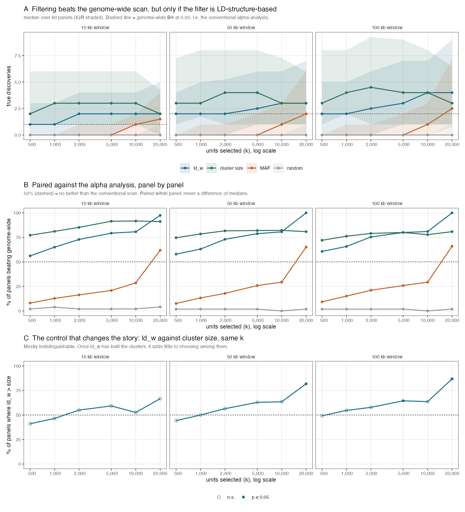
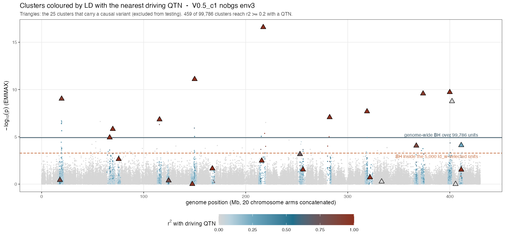

```{r setup, include=FALSE}
knitr::opts_chunk$set(echo = FALSE, message = FALSE, warning = FALSE,
                      fig.pos = "H", out.width = "100%")
suppressMessages({library(data.table); library(knitr)})
R   <- "../results/filter_then_test"
FIG <- "../figures"
clu <- fread(file.path(R, "filter_then_test_clusters_emx.csv"))
mk  <- fread(file.path(R, "filter_then_test_emx.csv"))
fdr <- fread(file.path(R, "filter_fdr_check_emmax.csv"))
key <- c("cell","tag","env","window_kb")
gw  <- clu[method=="genome_wide", c(key,"n_tp"), with=FALSE]; setnames(gw, "n_tp", "gw_tp")
f   <- merge(clu[method!="genome_wide"], gw, by=key)
winrate <- function(x) { nz <- x[x != 0]; if (!length(nz)) return(NA_real_); 100*sum(nz>0)/length(nz) }
signp   <- function(x) { nz <- x[x != 0]; if (!length(nz)) return(NA_real_); binom.test(sum(nz>0), length(nz))$p.value }
fmtp    <- function(p) ifelse(is.na(p), "--", ifelse(p < 1e-3, sprintf("%.1e", p), sprintf("%.3f", p)))
```

# What this document is

This describes a **different analysis from the C-score work**, resting on the
same premise. It is written separately because the machinery, the unit of
analysis, the truth definition and the comparison are all different, and reading
the two as variants of one thing has already caused confusion.

\begin{keybox}
\textbf{The shared premise.} $ld_w$ is computed from genotypes alone. It never
sees the phenotype. If it carries information about \emph{where} causal variation
sits, that information is available before any association test is run.

\textbf{What changed.} The C-score used that information to \textbf{rank}
markers. This uses it to \textbf{choose which units to test}. Ranking failed.
Selection works --- with one substantial qualification developed in
Section~\ref{sec:size}.
\end{keybox}

# Why the ranking approach was abandoned

Recorded so this document is self-contained, and so the same ground is not
re-covered. All comparisons are paired within run, with a sign test; never a
difference of means.

| Test | Result |
|:-----|:-------|
| $\tau_C = 0.05$ vs $\alpha = 0.05$ | C better in 79/151 (52%), $p = 0.63$ |
| PR-AUC at the operative distance cap | C better in 120/313 (38%), $p = 4.4\times10^{-5}$ |
| Stage-2 clusters as fixed units | $\alpha$ ahead by 0.07 PR, flat at every size floor |
| Restricting $\rho \geq 0.5$ | C worse by 0.002--0.009 |

Two external results agree. The 3sp panel session finds C *ties* an oracle
best-single-grid-cell rather than beating it, so the consistency layer buys
robustness to parameter choice, not power. The simulation-parsing session
measured the mechanism directly: reweighting a p-value by $ld_w$ moves a median
32% of the top-$k$ and nets **about one marker in 1,400** at 50--100 kb, and
exactly zero at 10 kb, which is tagging scale. A reweighting that small cannot
produce a detectable ranking gain, so the null result and the mechanism agree.

# The selection framing

## Independent filtering

Selecting $k$ units and applying BH within that set is **independent filtering**
in the sense of Bourgon, Gentleman and Huber (2010). The multiplicity correction
is applied over $k$ tests rather than all of them, so the threshold is less
severe. This is arithmetic --- it would work for *any* filter --- which is
exactly why the informative comparisons are not against the unfiltered scan but
against **other filters of the same size**.

Filtering is valid provided the filter statistic is independent of the test
statistic under the null. $ld_w$ is phenotype-blind, which is necessary but not
sufficient: $ld_w$ correlates with allele frequency, and frequency drives power.
Section~\ref{sec:fdr} tests this empirically rather than assuming it.

## The machinery

```{r machinery, results="asis"}
cat("\\begin{tabular}{@{}p{1.7cm}p{5.4cm}p{7.3cm}@{}}\n\\toprule\n")
cat("\\textbf{Component} & \\textbf{Choice} & \\textbf{Why} \\\\\n\\midrule\n")
rows <- list(
 c("Unit","Stage-2 LD cluster, represented by its pruned marker","Membership is recomputed per bundle and required to reproduce the stored GRM marker set exactly"),
 c("Filter","Top $k$ units by median $ld_w$ of members, computed before any phenotype","Median rather than max: robust to a single extreme member"),
 c("Test","BH at 0.05 within the selected set only","Identical to the conventional analysis, applied to fewer tests"),
 c("Truth","bp distance to nearest driving QTN, causal variants excluded","Shares no machinery with $ld_w$; an $r^2$-tagging truth would flatter it by construction"),
 c("Controls","MAF, cluster size, random --- all at identical $k$","Isolates enrichment from mere size reduction, and $ld_w$ from frequency"),
 c("Null","Surrogate environments (genetic basis), 100 draws","Preserves spatial and genetic structure; a naive shuffle destroys what $ld_w$ keys on"))
for (r in rows) cat(paste(r, collapse=" & "), "\\\\\n")
cat("\\bottomrule\n\\end{tabular}\n")
```

The genome-wide scan --- BH at 0.05 over all units --- **is** the conventional
$\alpha$ analysis. It is the baseline in every comparison below, so no separate
benchmark is needed.

# Results

## Power

```{r power-tab}
tab <- f[, .(ldw = winrate(n_tp[method=="ld_w"] - gw_tp[method=="ld_w"])), by = .(k, window_kb)]
w <- dcast(f[, .(win = winrate(n_tp - gw_tp)), by = .(method, k, window_kb)],
           method + k ~ window_kb, value.var = "win")
setnames(w, c("method","k","10 kb","50 kb","100 kb"))
w <- w[order(factor(method, levels=c("ld_w","size","MAF","random")), k)]
kable(w, digits = 0, booktabs = TRUE, longtable = TRUE,
      caption = "Percent of 80 panels in which each filter yields MORE true discoveries than the genome-wide alpha analysis. 50 = no better.")
```

Two things follow. $ld_w$ and cluster size both rise well above 50% and keep
rising with $k$; **MAF and random selection sit far below 50%**, meaning they are
worse than not filtering. Filtering normally *costs* real signal, and only a
filter enriched for causal neighbourhoods repays that cost.

The gain also scales with the multiplicity burden, as the mechanism predicts:
on 30k-marker tracks $ld_w$ reached
`r sprintf("%.0f%%", winrate(merge(mk[method!="genome_wide"], {g <- mk[method=="genome_wide", .(file, window_kb, g=n_tp)]; g}, by=c("file","window_kb"))[method=="ld_w" & k==5000 & window_kb==50, n_tp - g]))`
at $k = 5{,}000$, against
`r sprintf("%.0f%%", w[method=="ld_w" & k==5000][["50 kb"]])`% on these ~86k-unit panels.



## The mechanism

Filtering changes no p-value. It changes the BH threshold, because BH over
`r format(99786, big.mark=",")` units is far more severe than BH over 5,000.


On that panel the count goes from 27 discoveries (16 true) to 54 (22 true).
**Of the 28 gained units, 6 (21%) lie within 50 kb of a driving QTN**, so four in
five gained discoveries are not near one. Precision falls as recall rises; that
is the trade, and it is why Section~\ref{sec:fdr} is not optional.

## What the target actually looks like



Only **459 of 99,786 clusters** reach $r^2 \geq 0.2$ with any driving QTN --- under
0.5%. The strongest signals are the QTN-carrying clusters themselves, while the
surrounding neighbourhood at $r^2 = 0.3$--$0.6$ mostly sits below
$-\log_{10}(p) = 2$: recovering the *neighbourhood* is much harder than
recovering the variant. Several clusters that **carry** a causal variant sit at
$p \approx 1$, so carrying one is no guarantee of detection.

## FDR validity {#sec:fdr}

```{r fdr-tab}
g <- fdr[basis=="genetic"]
b <- g[method=="genome_wide", .(env, gwr = reject_rate)]
t2 <- merge(g[method!="genome_wide"], b, by="env")[
  , .(rate = mean(reject_rate), below_gw = sum(reject_rate < gwr), n = .N), by=.(method,k)]
t2 <- dcast(t2, k ~ method, value.var = "rate")
kable(t2, digits = 3, booktabs = TRUE,
      caption = sprintf("Fraction of 100 surrogate environments producing at least one rejection, averaged over 10 environments. Genome-wide baseline %.3f; alpha = 0.05. Genetic basis.",
                        mean(b$gwr)))
```

Every filtered rate sits at or below $\alpha$ and at or below the genome-wide
baseline. The baseline is honest rather than deflated: $\lambda_{\text{surr}}$
runs `r sprintf("%.3f--%.3f", min(g$lambda_surr), max(g$lambda_surr))` despite
these inputs being generated with `gc_mode = "none"`.

**This result is what licenses choosing $k$ at all.** Without it, any $k$ is a
fitted parameter and the power result would be worth little --- the same defect
that sank the C-score, whose advantage appeared only at a fitted $\tau$.

\begin{keybox}
\textbf{Two cautions.} False positives are heavy-tailed under $ld_w$: the same
rejection \emph{rate} as MAF but roughly twelve times the mean rejection
\emph{count}, so about 96\% of surrogates give nothing and the remainder give
tens to hundreds. Expected when selecting correlated high-LD regions, but it
means an occasional wholly spurious region \emph{set} rather than stray markers.

The \texttt{env\_orth} surrogate basis is \textbf{not} usable here: it rejects
genome-wide in 16--57\% of surrogates while $\lambda \approx 0.99$, so it is a
different-environment null rather than a no-signal null.
\end{keybox}


# The result is not uniform across simulation cells {#sec:cells}

The pooled numbers above average over four cells that differ in selection
strength and in background LD. They do not behave alike, and one of them
reverses the conclusion.

```{r cell-baseline}
gws <- clu[method=="genome_wide" & window_kb==50,
           .(panels = .N, `median true` = median(n_tp), `mean true` = round(mean(n_tp),2),
             `% panels with zero` = round(100*mean(n_tp==0))), by = cell][order(cell)]
kable(gws, booktabs = TRUE,
      caption = "Signal available to the conventional alpha analysis, per cell (50 kb window). Where the baseline is zero, beating it requires only one discovery.")
```

```{r cell-winrate}
byc <- f[window_kb==50 & method %in% c("ld_w","size"),
         .(win = winrate(n_tp - gw_tp), p = signp(n_tp - gw_tp),
           med_gain = median(n_tp - gw_tp)), by = .(cell, method, k)]
tw <- dcast(byc, cell + method ~ k, value.var = "win")
setnames(tw, c("cell","filter", paste0("k=", sort(unique(byc$k)))))
kable(tw[order(cell, filter)], digits = 0, booktabs = TRUE,
      caption = "Percent of 20 panels per cell in which the filter beats the genome-wide alpha analysis (50 kb window). Below 50 means the filter is WORSE than not filtering.")
```

\begin{keybox}
\textbf{$ld_w$ fails in \texttt{V0.5\_c2}, and cluster size does not.} $ld_w$ wins
in 28\% of panels there --- worse than no filtering --- flat across $k$ until the
selection is so large it has stopped being a filter. Cluster size wins in
\textbf{100\% of panels at every $k$} in the same cell. This is the widest
separation between the two filters anywhere in the data.
\end{keybox}

`V0.5_c2` is the high-background-LD cell ($b = 0.42$; it is the cell where the
old fixed $r^2 \geq 0.27$ cut sat *below* background LD). A plausible reading is
that $ld_w$ is a **local**-LD statistic, and where everything is correlated with
everything there is no local structure left for it to key on, whereas large
clusters still mark real linkage blocks. That is an interpretation of one cell,
not a tested mechanism.

Two consequences. First, the pooled claim in Section~\ref{sec:size} understates
the case against $ld_w$: the two filters are not merely indistinguishable on
average, $ld_w$ is **less robust across regimes**. Second, any application should
establish which regime it is in before choosing a filter.

```{r cell-gain}
tg <- dcast(byc[method=="ld_w"], cell ~ k, value.var = "med_gain")
setnames(tg, c("cell", paste0("k=", sort(unique(byc$k)))))
kable(tg, booktabs = TRUE,
      caption = "Median gain in true discoveries over the genome-wide analysis, ld_w filter, 50 kb. Read alongside the win rates: a high win rate on a zero baseline can rest on a gain of one.")
```

# The size control, and what it costs the claim {#sec:size}

```{r size-tab}
cc <- merge(f[method=="ld_w",   c(key,"k","n_tp"), with=FALSE],
            f[method=="size", c(key,"k","n_tp"), with=FALSE],
            by=c(key,"k"), suffixes=c("_l","_s"))
cs <- cc[, .(win = winrate(n_tp_l - n_tp_s), p = signp(n_tp_l - n_tp_s)), by=.(k, window_kb)]
cs[, cell_txt := sprintf("%.0f%%  (p %s)", win, fmtp(p))]
out <- dcast(cs, k ~ window_kb, value.var = "cell_txt")
setnames(out, c("k selected", "10 kb", "50 kb", "100 kb"))
kable(out, booktabs = TRUE, align = c("r","c","c","c"),
      caption = "$ld_w$ against cluster size at identical $k$: percent of the 80 panels in which $ld_w$ yields more true discoveries, with the sign-test p-value. Values near 50 percent mean the two filters are indistinguishable.")
```

Selecting the $k$ **largest** clusters performs as well as selecting on $ld_w$.
Up to $k = 10{,}000$ the two are statistically indistinguishable at every window
--- win rates of 41--65% with sign-test $p$ from 0.03 to 1.0, straddling the
50% line. This was a pre-specified control and it lands against the $ld_w$ story
across the range where filtering is most useful.

$ld_w$ does separate at the largest selection, $k = 20{,}000$ (82% at 50 kb,
87% at 100 kb, $p \leq 4\times10^{-6}$). That is a real difference and is
reported as such, but it is one corner of the grid, it is the regime where the
filter is least selective, and the C-score failed in exactly this way --- an
advantage visible only at a fitted corner. It should not be promoted to the
headline without a pre-specified reason to operate there.

One qualification keeps it from being fatal, and it cuts both ways. Cluster size
is **not an independent rival**: the clusters exist because $ld_w$-based
clustering built them, so size is downstream of $ld_w$. What the result shows is
that once the clusters exist, consulting $ld_w$ again to choose among them adds
little. The information has already been spent.

# What is established, and what is not

```{r status, results="asis"}
cat("\\begin{tabular}{@{}p{6.0cm}p{2.2cm}p{6.2cm}@{}}\n\\toprule\n")
cat("\\textbf{Claim} & \\textbf{Status} & \\textbf{Basis} \\\\\n\\midrule\n")
rows <- list(
 c("Independent filtering of LD clusters beats a genome-wide scan","Established","80 panels, 56--97\\% win rate, rising with $k$"),
 c("The filter must be LD-structure-based","Established","MAF and random are significantly WORSE than no filtering"),
 c("Filtered BH controls FDR under a structure-preserving null","Established","Rates 0.027--0.039 vs $\\alpha$ 0.05, at or below genome-wide"),
 c("The gain grows with the multiplicity burden","Supported","Marker tracks (30k) weaker than pooled panels (86k); one comparison, not a designed sweep"),
 c("$ld_w$ specifically is needed at selection time","\\textbf{Not supported}","Cluster size matches it at every $k$, and beats it outright in \\texttt{V0.5\\_c2}"),
 c("The filters behave alike across regimes","\\textbf{Contradicted}","$ld_w$ wins 28\\% of panels in \\texttt{V0.5\\_c2} where cluster size wins 100\\%"),
 c("This transfers to empirical data","Untested here","Simulations only; the 3sp panel session reports a much larger effect"))
for (r in rows) cat(paste(r, collapse=" & "), "\\\\\n")
cat("\\bottomrule\n\\end{tabular}\n")
```

## What would falsify the main claim

A filter of the same size, not derived from LD structure, that matches $ld_w$ and
cluster size. MAF and recombination rate were tried and both fail badly. A
positive result there would reduce the finding to arithmetic.

## Known limits

The truth is bp proximity, so a discovery 49 kb from a QTN counts and one at
51 kb does not; results are reported at three windows because of this. Signal
varies enormously between panels --- a median of 20 significant markers per
bundle, IQR 1--90, with **23% having none at all** --- so single-panel figures
illustrate mechanism and are not evidence. Cluster-level $p$-values come from one
representative marker per cluster, not a within-cluster combination. Only the
EMMAX engine is analysed here.

# Provenance

## Which simulation generation each result uses

These results do **not** all come from the same simulations, and the main
cluster-level result does not come from the newest.

```{r gens, results="asis"}
cat("\\begin{tabular}{@{}p{2.5cm}p{3.5cm}p{2.8cm}p{5.6cm}@{}}\n\\toprule\n")
cat("\\textbf{Generation} & \\textbf{Maps} & \\textbf{Fitted half-decay} & \\textbf{Used for} \\\\\n\\midrule\n")
rows <- list(
  c("\\texttt{bgs5}", "MAP\\_RES 3.3e-5; 31.5\\% of markers share a position",
    "55.8 kb (18 win/chr, $\\sim$3 Mb spans)",
    "\\textbf{cluster-level power (the main result) and both manhattans}"),
  c("\\texttt{pilot\\_v2\\_v05c1}", "MAP\\_RES 3.3e-6; no shared positions",
    "13.3 kb (95 win/chr, $\\sim$0.56 Mb spans)",
    "marker-level power only; \\texttt{V0.5\\_c1} only"),
  c("\\texttt{analysis\\_inputs}", "pre-bgs5", "not compared",
    "FDR validity only; \\texttt{V2\\_c1}, nobgs, \\texttt{gc\\_mode = none}"))
for (r in rows) cat(paste(r, collapse = " & "), "\\\\\n")
cat("\\bottomrule\n\\end{tabular}\n")
```

The two generations differ 4.2$\times$ in fitted half-decay, and at $\rho = 0.5$
the half-decay **is** the stage-2 clustering distance --- so the test units
themselves would differ on the newer maps. The difference traces to the decay
fitting scale rather than to the maps: same-position marker pairs show $r^2$ of
0.023 against 0.022 for pairs 1 bp--10 kb apart, so the collapsed positions do
not inflate LD. Whether the main result survives re-clustering at the newer
decay settings is **untested**.

```{r prov}
kable(data.frame(
  Item = c("Power, cluster level", "Power, marker level", "FDR validity",
           "Figures", "Bundles", "Surrogate p-values", "Tracks", "Parameters", "Commits"),
  Detail = c("`filter_then_test_clusters.R`, 80 panels x ~86k units, run on mini1 (8 cores)",
             "`filter_then_test.R`, 63 runs of `pilot_v2_v05c1` tracks",
             "`filter_fdr_check.R`, 10 environments x 100 surrogates x 2 bases",
             "`plot_filter_then_test.R`, `plot_filter_manhattan.R`, `plot_filter_manhattan_ld.R`",
             "`regen_sim_data_bgs5` (older generation, see above), 800 files",
             "`analysis_inputs`, V2_c1, B = 100, `gc_mode = none`",
             "`pilot_v2_v05c1/tracks`, V0.5_c1, 8 environments",
             "alpha 0.05; stage-2 `min_r2_rho` 0.5, `distance_threshold` 1e5; scoring `dmax_cap` 1e5",
             "`60c8134` cap harmonisation, `88797ff` this machinery"),
  check.names = FALSE), booktabs = TRUE, longtable = TRUE)
```

All comparisons in this document are **paired within panel with a sign test**.
Differences of means and medians are not used anywhere: three claims in this
project were withdrawn after a positive mean turned out to sit on a sign count at
chance.
