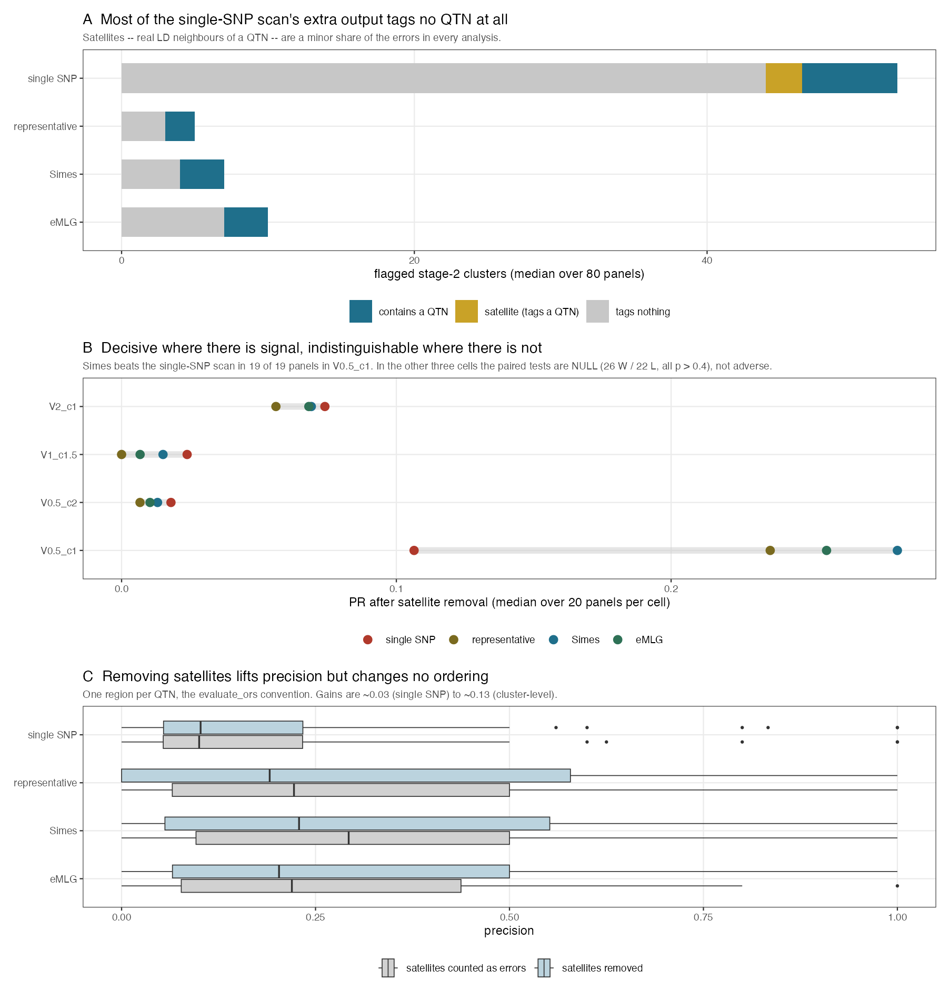

```{r setup, include=FALSE}
knitr::opts_chunk$set(echo = FALSE, message = FALSE, warning = FALSE, fig.pos = "H", out.width = "100%")
suppressMessages({library(data.table); library(knitr)})
d <- fread("../results/filter_then_test/snp_vs_cluster_dedup_allpanels.csv")
d[, `:=`(raw_PR = raw_prec * raw_rec, dedup_PR = dedup_prec * dedup_rec)]
lab <- c(snp = "single SNP", rep = "representative", simes = "Simes", emlg = "eMLG")
d[, an := factor(lab[analysis], levels = lab)]
w <- dcast(d, cell + tag + env ~ an, value.var = "raw_PR")
pr <- function(x) { x <- x[is.finite(x)]; nz <- x[x != 0]
  list(w = sum(nz > 0), l = sum(nz < 0), t = sum(x == 0), med = median(x),
       p = if (length(nz)) binom.test(sum(nz > 0), length(nz))$p.value else NA_real_) }
fp <- function(p) ifelse(is.na(p), "--", ifelse(p < 1e-3, sprintf("%.0e", p), sprintf("%.3f", p)))
esc <- function(s) gsub("_", "\\\\_", s)
```

# The problem

A genome scan tests every SNP, but the object of interest is a **locus**. In
linkage disequilibrium those are not the same thing, and the difference is not
cosmetic: on one pooled panel of 294,609 markers, a single-SNP scan controlling
FDR at 5% returned **2,467 significant SNPs, which were 132 distinct LD
clusters**. The rejected SNPs were 18.7 per cluster against a panel average of
3.0, so the small-$p$ tail was **6.3 times more redundant** than the genome as a
whole.

Benjamini--Hochberg remains valid here --- FDR control holds under positive
regression dependence, which linkage supplies --- but the quantity it controls is
the false discovery proportion **among SNPs**. A reader interpreting "5% FDR over
2,467 discoveries" is being given a guarantee about a different object from the
one they are counting.

\begin{keybox}
Testing near-independent LD clusters makes the controlled quantity FDR
\textbf{over loci}. That is an argument about what the procedure guarantees, not
about which method scores better, and it holds on any dataset --- with or without
known causal positions.
\end{keybox}

# Method

Markers are grouped into **stage-2 LD clusters** by the two-stage complexity
chain (`ld_complexity_reduction` at $\rho = 0.5$, then `ld_prune_and_eMLG` with
`min_r2_rho = 0.5`, `distance_threshold = 1e5`). Every marker belongs to exactly
one cluster; nothing is discarded. Cluster sizes are strongly skewed --- a median
of 1 with a long tail --- so most clusters are single markers and a minority are
large linkage blocks.

Each cluster receives one p-value by **Simes combination over its members**,
which is valid under positive regression dependence and uses all member evidence
rather than a single marker. BH is then applied across clusters.

```{r units, results="asis"}
cat("\\begin{tabular}{@{}p{3.6cm}p{10.6cm}@{}}\n\\toprule\n")
cat("\\textbf{Choice} & \\textbf{Why} \\\\\n\\midrule\n")
rows <- list(
 c("Unit = stage-2 LD cluster","Fixed before the phenotype is seen; every marker belongs to one"),
 c("Simes over members","Uses all member p-values, valid under PRDS. Outperforms every single-marker summary tested, including the LD-central representative, the highest-$ld_w$ member and the uncorrected minimum"),
 c("BH across clusters","The controlled quantity becomes FDR over loci"),
 c("No $ld_w$ threshold","$ld_w$ builds the clusters but sets no cut. Requiring several members of a block to agree discriminates in the same direction with no free parameter"))
for (r in rows) cat(paste(r, collapse = " & "), "\\\\\n")
cat("\\bottomrule\n\\end{tabular}\n")
```

# Scoring: do not expect one region per QTN {#sec:scoring}

A causal variant sits inside one cluster, but several *neighbouring* clusters may
be in linkage with it. How those are counted changes the numbers substantially,
so any figure must name its convention.

```{r conv, results="asis"}
cat("\\begin{tabular}{@{}p{2.6cm}p{11.6cm}@{}}\n\\toprule\n")
cat("\\textbf{Convention} & \\textbf{A flagged cluster counts as a true positive if\\dots} \\\\\n\\midrule\n")
cat("containment & it physically contains a driving QTN. Strictest; every LD neighbour is an error. \\\\\n")
cat("tagging & it reaches $r^2 \\ge r^2_{\\min}$ with a QTN within $d_{\\max}$. Most permissive. \\\\\n")
cat("dedup & it is the \\emph{best} tagger of a QTN. One region per QTN; further taggers are removed rather than counted as errors. This is the \\texttt{evaluate\\_ors} convention and the one used below. \\\\\n")
cat("\\bottomrule\n\\end{tabular}\n")
```

\noindent On one panel the same Simes result scored **0.429 precision by
containment, 0.643 by tagging and 0.545 by dedup**. The three answer different
questions; none is wrong.

The dedup convention is the informative one because it separates two kinds of
error that behave quite differently: a **satellite** is a genuine LD neighbour of
a locus already found, whereas a cluster that tags nothing is simply wrong.

# Result

## Where the flagged regions go

```{r decomp}
z <- d[, .(flagged = median(flagged), contains = median(contain),
           satellite = median(tag_not_contain), `tags nothing` = median(neither)), by = an]
kable(z, booktabs = TRUE,
      caption = "Median flagged stage-2 clusters per panel, decomposed. 80 panels: 4 simulation cells x 2 background-selection arms x 10 environments, each pooling 10 map sets into a genome-wide panel of about 90,000 clusters.")
```

\begin{keybox}
\textbf{The single-SNP scan's extra output is overwhelmingly noise, not near
misses.} Its median panel flags `r round(median(d[an=="single SNP"]$flagged))`
clusters of which `r round(median(d[an=="single SNP"]$neither))` tag no QTN
anywhere, against `r round(median(d[an=="single SNP"]$tag_not_contain))`
satellites. Cluster-level testing flags
`r round(median(d[an=="Simes"]$flagged))` and recovers
`r round(median(d[an=="Simes"]$contain))` QTN-bearing clusters.

Satellites are a minor share of the errors in \emph{every} analysis. Merging
adjacent flagged clusters through a second clustering step therefore has a low
ceiling: it never increases the region count (0 wins in 320 paired comparisons)
and improves precision in 166 of 168 non-tied cases, but by a median of only
0.002.
\end{keybox}



## Precision and recall

```{r pr}
z <- d[, .(precision = round(median(dedup_prec, na.rm = TRUE), 3),
           recall = round(median(dedup_rec), 3),
           PR = round(median(dedup_PR, na.rm = TRUE), 4)), by = an]
kable(z, booktabs = TRUE, caption = "Median over 80 panels, dedup convention.")
```

```{r bycell, results="asis"}
cat("\\begin{tabular}{@{}lrrrl@{}}\n\\toprule\n")
cat("Cell & Simes wins & losses & ties & sign test \\\\\n\\midrule\n")
for (cl in sort(unique(w$cell))) {
  z <- w[cell == cl]; s <- pr(z$Simes - z$`single SNP`)
  cat(sprintf("\\texttt{%s} & %d & %d & %d & %s \\\\\n", esc(cl), s$w, s$l, s$t, fp(s$p)))
}
s <- pr(w$Simes - w$`single SNP`)
cat("\\midrule\n")
cat(sprintf("\\textbf{pooled} & %d & %d & %d & %s \\\\\n", s$w, s$l, s$t, fp(s$p)))
cat("\\bottomrule\n\\end{tabular}\n")
```

# Scope, and what it means for real data

\begin{keybox}
Cluster-level testing wins decisively where there is signal to aggregate, and is
\textbf{indistinguishable} where there is not. It is not worse anywhere. In the
low-signal cells the paired comparisons are null, not adverse --- several panels
are ties in which neither analysis recovers anything, so those panels carry no
information about which method is better.
\end{keybox}

Two consequences for an empirical analysis, where causal positions are unknown:

**The core argument needs no truth.** Testing near-independent units makes the
reported FDR a statement about loci. That follows from what BH controls, not from
any performance comparison, so it transfers directly.

**The performance numbers do not transfer.** Precision and recall here are
simulation quantities. What can be checked on real data without truth is
calibration under a structure-preserving permutation, replication of the same
clusters across environments or subsets, and stability under resampling.

# Provenance

Simulations: `regen_sim_data_bgs5`, 4 cells $\times$ 10 environments $\times$ 2
BGS arms $\times$ 10 map sets. Association: EMMAX per marker against a GRM built
from the pruned markers, so clustering conditions the null rather than the test.
Truth: driving QTN, defined as MAF $>$ 0.1 with within-chromosome $p_{Va} \ge
0.05$. Scripts: `snp_vs_cluster_dedup.R`, `cluster_summary_test.R`,
`plot_clustering_gain.R`.

Every comparison is **paired within panel** and reported with wins, losses, ties
and a sign test. Differences of means are not used.
